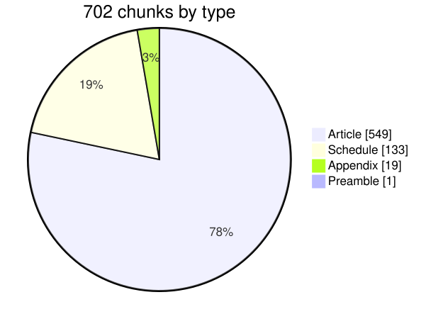
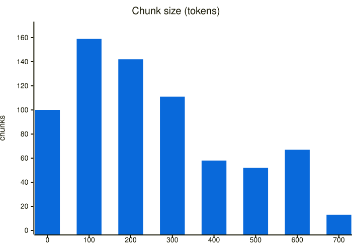

<div align="center">

# 🇮🇳 Samvidhan RAG

**Ask the Constitution of India anything — get answers cited to the exact Article.**


-0.93-2ea44f)


<sub>Informational only — not legal advice.</sub>

</div>

---

## 🗺️ Where we are

<a href="docs/diagrams/roadmap.svg"></a>

<sub>🖱️ Click any diagram to open it full size · click a phase below to see its steps</sub>

<details>
<summary>✅ <b>1 · Chunking & storing in DB</b> — done</summary>

1. ⚙️ Project setup — config, logging, Docker Postgres + pgvector, migrations, FastAPI health checks
2. 📕 Official PDF (edition as on 1 May 2024) + local models (`make models`)
3. 🔤 Extract text rows with font size, bold and position (PyMuPDF)
4. 🧹 Clean — drop running headers and page numbers
5. 📝 Footnotes — attach 754 amendment notes
6. 🧱 Segment — Part › Chapter › Article / Schedule / Appendix
7. ✂️ Chunk — one chunk per Article, long ones split at clauses
8. ✅ Validate — 506 / 506 Articles, none missing or duplicated
9. 🧠 Embed with bge-m3 (1024-d)
10. 🐘 Store in Postgres — vector + full-text index, idempotent re-runs
11. 🧪 Tests — unit, integration and real-PDF runs (102 passing)

</details>

<details>
<summary>🟡 <b>2 · Eval harness</b> — partial (what retrieval needed)</summary>

1. 🟡 67 golden Q&A cases drafted (golden v0.2: 7 router labels fixed), review pending
2. ⬜ Generate +90 synthetic cases, human-reviewed
3. 🟡 20 multi-turn conversations drafted (58 turns, one 9-turn chat; golden v0.3), review pending
4. 🟡 Dev / test split (≈70 / 30) on the drafted set
5. ✅ Metrics — Recall@k, Hit@1, MRR, nDCG, candidate recall
6. ✅ `eval.run --suite retrieval` with reports and baseline compare
7. ⬜ CI job on every PR

</details>

<details>
<summary>🟡 <b>3 · Query & retrieval</b> — built; 2 gaps before baseline</summary>

1. ✅ Dense search — query embedding + HNSW cosine
2. ✅ Lexical search — Postgres full-text (terms OR-ed)
3. ✅ Fuse both lists with RRF
4. ✅ Exact lookup — "Art. 21-A" → `21A` → all its chunks, pinned
5. ✅ Rerank with bge-reranker (15 → top 5), RRF order if it fails
6. ✅ Ablation ([`ablation_v1.md`](eval/reports/ablation_v1.md)) and confidence threshold tuning
7. ⬜ Promote baseline — candidate recall@15 0.875 (gate 0.95) and rerank latency (p95 ~4–5 s, SLO 0.8 s) open

</details>

<details>
<summary>🟡 <b>4 · LLM & router</b> — built; router eval waits for API keys</summary>

1. ✅ LiteLLM client — Groq primary (Qwen3.8 27B router, gpt-oss-120b answers), Gemini 3.5 fallback, 1 retry,
   every attempt logged to `llm_calls`
2. ✅ Daily budget guard — near a model's cap, switch to the fallback; both capped → "busy"
3. ✅ Router — rewrites the question, extracts Article refs and picks the route (JSON, falls back to `simple`)
4. ✅ HyDE for broad questions, sub-question search for multi-part ones
5. ✅ Answer prompt — answers only from retrieved chunks, streams tokens
6. ✅ Citation check — citations not in the retrieved text are removed; disclaimer added
7. ✅ Canned replies for greetings, vague and out-of-scope questions
8. ✅ LangGraph pipeline + Mermaid export; `make ask` / `make chat` from the terminal
9. ⏳ Router eval on dev (`make eval-router`) — needs `GROQ_API_KEY`
10. 🟡 Long-question mode — answer styles and the 70B router in; long context limits not yet

</details>

<details>
<summary>🟡 <b>5 · Chat API</b> — built; cleanup job, multi-turn eval and limit tests left</summary>

1. ✅ Sessions, messages and feedback tables (migration 004) + repositories
2. ✅ `POST /v1/sessions`, history pages, `DELETE` (messages go, feedback snapshots stay)
3. ✅ Chat memory in Postgres — last 6 messages + `last_articles`, Articles and Parts discussed, recent topics;
   "what are its exceptions?" resolves to the Article cited last
4. ✅ `POST /v1/chat` — the LangGraph pipeline streamed as SSE (`meta → token… → citations → done`), or JSON
5. ✅ Feedback, `GET /v1/articles/{no}` (citation chips), `GET /v1/meta`; OpenAPI snapshot in
   [`docs/api/openapi.json`](docs/api/openapi.json)
6. ✅ Rate limits (per session, per IP, new chats per IP per day) and message size / empty / full-chat checks
7. ✅ 30-day session cleanup (`make cleanup`, run daily) — feedback kept with its Q&A snapshot, unlinked
8. ✅ Multi-turn router eval — each turn replayed with the expected earlier turns as memory; standalone
   question gated at ≥ 0.90
9. ✅ Log completeness — one request logs every stage with the same `request_id`
10. ✅ Limit tests for every HLD §13.2 limit, incl. new: 503 `BUSY` above `MAX_CONCURRENT_STREAMS` and a note
    when a question names more than `MAX_ARTICLE_REFS` Articles

</details>

<details>
<summary>⬜ <b>6 · UI</b></summary>

1. 💬 Streamlit chat with streaming answers
2. 📎 Citation chips → full Article text
3. 👍 Feedback buttons and a debug panel

</details>

<details>
<summary>⬜ <b>7 · v1.0 release</b></summary>

1. 📊 Full eval with RAGAS on the test split
2. 🏋️ Load test and failure drills
3. 🔒 Security pass
4. 🏷️ Tag `v1.0.0`

</details>

<sub>📋 [Full plan](docs/plans/implementation-plan.md) · 🏛️ [Design (HLD)](docs/design/HLD.md) · 🧭 [Decisions (ADRs)](docs/adr/README.md)</sub>

---

## 🧩 The big picture

<a href="docs/diagrams/big-picture.svg"></a>

---

## 🤖 How a question is answered

> **One small LLM call routes, one large LLM call answers** — a fixed LangGraph pipeline, not an agent.
> <sub>[Why? → ADR-0003](docs/adr/0003-deterministic-router-not-agent.md) · [ADR-0011](docs/adr/0011-langgraph-orchestration.md) · [spec](docs/specs/llm-router-generation.md)</sub>

<a href="docs/diagrams/langgraph.svg"></a>

<sub>Drawn from the compiled graph itself (`make graph`), so it can't drift from the code.</sub>

| Route | Example | What happens | LLM calls |
|:--|:--|:--|:-:|
| `article_lookup` | "explain art. 21-A" | Article fetched by number, plus search for context | 2 |
| `simple` | "Who appoints the Chief Election Commissioner?" | Hybrid search + rerank | 2 |
| `conceptual` | "How does the Constitution protect minorities?" | HyDE passage for the vector search | 3 |
| `multi_part` | "Compare Article 32 and 226" | One search per sub-question, merged | 2 |
| `ambiguous` · `out_of_scope` · `chitchat` | "What are my rights?" · "BNS theft?" · "hi" | Canned reply, no search | 1 |

<details>
<summary>🛡️ <b>Click — what keeps answers honest</b></summary>

| Guard | How |
|:--|:--|
| Only the retrieved text | The answer prompt gets numbered excerpts and must cite them as `[Art. 21]` |
| Hallucinated citations | Any `[Art. N]` not among the retrieved chunks is removed and logged (`invalid_citation`) |
| Nothing found | No answer LLM call — a "not covered" reply instead |
| Weak match | The prompt is told retrieval is weak and must say the text may not cover it |
| Prompt injection | Excerpts and the user's message are data; the router sends "ignore your rules" to `out_of_scope` |
| Provider down / bad key | 1 retry → Gemini fallback → `LLM_UNAVAILABLE` |
| Free-tier quota | Usage counted from `llm_calls`; near the cap → fallback model → "busy" |
| Every call traceable | One `llm_calls` row per attempt: model, tokens, latency, TTFT, status, prompt version |

</details>

<details>
<summary>💻 <b>Click — try it from the terminal</b></summary>

```bash
make ask Q="What does Article 21 say?"              # needs GROQ_API_KEY in .env
make ask Q="Can police arrest me?" ARGS=--fake-llm  # no keys: scripted LLM, real search
make chat                                           # follow-ups keep the context
```

```text
Q: What does Article 21 say?
A: (fake LLM — no model was called) The most relevant provisions retrieved are:
- Protection of life and personal liberty: "… No person shall be deprived of his life or personal liberty
  except according to procedure established by law.…" [Art. 21]

_Informational only, based on the text of the Constitution of India (as on 1 May 2024). Not legal advice._

Citations:
  [Art. 21] Protection of life and personal liberty

route=article_lookup style=brief refs=['21'] fallback=False low_confidence=False
llm_call purpose=router model=fake/model status=ok …
llm_call purpose=answer model=fake/model status=ok …
```

</details>

<details>
<summary>📡 <b>Click — talk to the API with curl</b></summary>

```bash
make run                                             # API on :8000 (loads bge-m3 + reranker first)
SID=$(curl -s -XPOST localhost:8000/v1/sessions | jq -r .session_id)
curl -N localhost:8000/v1/chat -H 'content-type: application/json' \
  -d "{\"session_id\":\"$SID\",\"message\":\"What does Article 21 say?\"}"
curl -N localhost:8000/v1/chat -H 'content-type: application/json' \
  -d "{\"session_id\":\"$SID\",\"message\":\"What are its exceptions?\"}"
```

```text
event: meta
data: {"route_type": "simple", "standalone_query": "What are the exceptions and limitations to the right
       to life and personal liberty under Article 21?", "refs": ["21"], …}      ← "its" = Art. 21, from memory
event: token
data: {"text": "The Constitution’s text of Article 21 states only"}               ← …111 token events
event: citations
data: {"citations": [{"ref": "21", "label": "Art. 21", "title": "Protection of life and personal liberty"}]}
event: done
data: {"message_id": 4, "answer": "…", "low_confidence": false, "latency_ms": {"route": 592, …}}
```

| Endpoint | What it does |
|:--|:--|
| `POST /v1/sessions` | New anonymous chat → `{session_id}` (UUIDv7) |
| `GET /v1/sessions/{id}/messages?limit=&before=` | History, oldest first, paged |
| `DELETE /v1/sessions/{id}` | Clear the chat |
| `POST /v1/chat` | `{session_id, message, stream}` → SSE, or JSON with `stream: false` |
| `POST /v1/messages/{id}/feedback` | 👍 / 👎 `{rating: 1 or -1, comment?}` |
| `GET /v1/articles/{no}` | Full text of `21A`, `21-A`, `Sch. 7`, `preamble`… |
| `GET /v1/meta` | Edition date, pipeline versions, model ids |

Limits: 10 chats/min per session, 30/min and 300/day per IP, 20 new chats per IP per day (IP = TCP peer, or `X-Forwarded-For` from `TRUSTED_PROXY_IPS`), 4,000-character
messages, 200 messages per chat, 20 answers streaming at once → HTTP 429 (with `Retry-After`) / 422 / 409 / 503.
Spec: [`api-sessions-memory.md`](docs/specs/api-sessions-memory.md).

</details>

### 🔀 Router eval

`make eval-router` runs every dev question through the real router (gates: type accuracy ≥ 0.90, refs F1 ≥ 0.95,
JSON validity ≥ 0.99, answer style ≥ 0.85). **First dev run in progress** with the new lineup — results land here.

> ⚠️ Groq retired the Llama 3.1 8B / 3.3 70B models this project first planned on (2026-10-01). The router now runs
> on `qwen/qwen3.8-27b` and answers on `openai/gpt-oss-120b`, with their hidden reasoning turned down
> (`MODEL_REASONING_EFFORT`). Groq's free tier is 1,000 requests/day and 8,000 tokens/min per model, so the eval
> paces itself at 5 calls/min. See [HLD §6](docs/design/HLD.md#6-models).

---

## 📄 How chunking works

> **One chunk per Article** — the Constitution's own structure, not fixed-size windows. <sub>[Why? → ADR-0001](docs/adr/0001-structure-aware-chunking.md)</sub>

<a href="docs/diagrams/chunking-pipeline.svg"></a>

<details>
<summary>🔍 <b>Click — what each step does</b></summary>

| Step | Module | Key trick |
|:--|:--|:--|
| 🔤 Extract | [`extract.py`](src/samvidhan/ingestion/extract.py) | Footnote numbers → `{{fn:N}}` tokens; rows rebuilt by position |
| 🧹 Clean | [`clean.py`](src/samvidhan/ingestion/clean.py) | Body starts at **PREAMBLE**, runs to the end |
| 📝 Footnotes | [`footnotes.py`](src/samvidhan/ingestion/footnotes.py) | Numbered by position — survives PDF typos |
| 🧱 Segment | [`segment.py`](src/samvidhan/ingestion/segment.py) | Headings found by **position**, not bold |
| ✂️ Chunk | [`chunk.py`](src/samvidhan/ingestion/chunk.py) | Long Articles split at clauses `(1)`, `(2)`… |
| ✅ Validate | [`validate.py`](src/samvidhan/ingestion/validate.py) | Every Article present, none twice |
| 🧠 Embed | [`embed.py`](src/samvidhan/ingestion/embed.py) | Local model, no API cost |
| 🐘 Store | [`corpus.py`](src/samvidhan/db/repositories/corpus.py) | Same PDF twice → no-op |

📘 Full detail: [ingestion spec](docs/specs/ingestion.md)
</details>

### ✂️ Chunking rules

<a href="docs/diagrams/chunking-rules.svg"></a>

### 🔬 Anatomy of one chunk

<a href="docs/diagrams/chunk-anatomy.svg"></a>

---

## 📊 What landed in the database

<table>
<tr>
<td width="50%">

<a href="docs/diagrams/chunks-by-type.svg"></a>

</td>
<td width="50%">

<a href="docs/diagrams/chunk-sizes.svg"></a>

</td>
</tr>
</table>

| | | | |
|:-:|:-:|:-:|:-:|
| 📚 **506** Articles | ✂️ **28** split | 🚫 **34** omitted | 📋 **12** Schedules |
| 📎 **3** Appendices | 📝 **754** footnotes | 📏 **799** max tokens | ⏱️ **~2 min** full ingest |

---

## 🧪 How it was tested

<a href="docs/diagrams/tests.svg"></a>

### ✅ Results

| Check | Result |
|:--|:-:|
| All tests (unit + integration + real PDF + live LLM) | 🟢 **344 / 344** (live: `make test-llm`) |
| Articles found vs Contents list | 🟢 **506 / 506** |
| Missing · duplicate · unexpected | 🟢 **0 · 0 · 0** |
| Chunks over the 1,024-token limit | 🟢 **0** |
| Every vector 1024-d, unit length | 🟢 |
| Re-running the same PDF | 🟢 no-op |
| Every LLM attempt → one `llm_calls` row (FakeLLM over Postgres) | 🟢 |
| Bad primary key → fallback model | 🟢 (FakeLLM; live check: `make test-llm`) |
| Graph end to end, all 7 route types (FakeLLM + real Postgres search) | 🟢 |
| `/v1` API over Postgres: SSE order, follow-up resolved from stored memory, history, feedback | 🟢 |
| Every HLD §13.2 limit (length, empty, long-query router, caps, truncation, rate, concurrency, timeout) | 🟢 14 tests |
| One request → every stage logged with the same `request_id` (+ its `llm_calls` rows) | 🟢 |
| Session expiry: idle > 30 days deleted, feedback kept anonymised | 🟢 |
| Live: two-turn `curl -N` chat, follow-up → Art. 21 via `last_articles` | 🟢 |
| ruff · mypy --strict | 🟢 clean |

<details>
<summary>🐛 <b>Click — tricky things the real PDF taught us (and the tests that pin them)</b></summary>

| 😬 Surprise in the PDF | 🔧 Fix |
|:--|:--|
| Headings are **not bold** | Detect by centered position |
| Omitted Articles have **no bold** | Match `21A.` pattern at heading indent |
| Footnote `1` printed on 6 pt vs 7.9 pt text | Compare to the **document** body size |
| Contents say `243-I`, body says `243I` | Normalise both |
| Footnote numbered `2.` twice (typo) | Number footnotes **by position** |
| `1 S.C.C. 362` looked like footnote 1 | Undotted numbers need a marker on the page |
| Part VII omitted entirely → no Art. 238 | Stub chunk: *"Omitted."* + amendment note |
| Appendix I has its own "FIRST SCHEDULE" | Structure rules off inside Appendices |

Tests: [`tests/unit`](tests/unit) · [`tests/integration`](tests/integration)
</details>

### 🔎 Hybrid search check

`python -m samvidhan.retrieval.cli search "<question>"` — dense + full-text → RRF → rerank.

| 🙋 Question | 🥇 Top hit | Rerank score |
|:--|:--|:--|
| Can the police arrest me and keep me locked up without telling me why? | **Art. 22** · Protection against arrest and detention | 0.26 |
| Who appoints the Chief Election Commissioner? | **Art. 324** · Superintendence … of elections | 0.97 |
| Is police a state subject or a union subject? | **Seventh Schedule** | 0.28 |

### 📏 Retrieval eval — dev split, golden v0.1

36 gated cases (long questions are scored separately until Phase 4) · mode: dense + full-text → RRF → rerank ·
`make eval-retrieval` · report: [`2026-10-01T06-29-04_retrieval_dev.md`](eval/reports/2026-10-01T06-29-04_retrieval_dev.md)

| Metric | Value | Gate | Status |
|:--|:--:|:--:|:--:|
| Recall@5 | **0.931** | ≥ 0.90 | ✅ |
| MRR@10 | **0.931** | ≥ 0.75 | ✅ |
| Hit@1 (Article lookups) | **1.000** | = 1.00 | ✅ via pinning |
| Candidate recall@15 (before rerank) | **0.875** | ≥ 0.95 | ❌ |
| nDCG@5 | 0.877 | — | info |
| Retrieval latency p50 / p95 | 76 / 95 ms | p95 ≤ 300 ms | ✅ |
| Rerank latency p50 / p95 | 2,817 / 4,846 ms | p95 ≤ 800 ms | ❌ |

Baseline not promoted yet: candidate recall and rerank latency are open.

<details>
<summary>📌 <b>Pinned vs search only</b> — what happens if the router misses the Article</summary>

12 of 36 questions name an Article ("explain art. 21-A"). The eval pins it, standing in for a perfect Phase 4
router. The search legs alone score:

| Recall@5 | MRR@10 | Hit@1 | Hit@1 (lookups) |
|:--:|:--:|:--:|:--:|
| 0.875 | 0.811 | 0.750 | 0.500 |

So exact lookups depend on the router extracting refs (ADR-0004, gated at refs F1 ≥ 0.95 in Phase 4).
</details>

<details>
<summary>🗂️ <b>By category</b></summary>

| Category | n | Recall@5 | MRR@10 | Hit@1 | Cand. recall@15 |
|:--|:--:|:--:|:--:|:--:|:--:|
| article_lookup | 10 | 1.000 | 1.000 | 1.000 | 0.800 |
| simple (plain language) | 12 | 0.917 | 0.917 | 0.917 | 0.917 |
| multi_part | 3 | 1.000 | 1.000 | 1.000 | 1.000 |
| conceptual | 3 | 1.000 | 1.000 | 1.000 | 1.000 |
| schedule | 4 | 0.750 | 0.625 | 0.500 | 0.750 |
| omitted_amended | 3 | 0.833 | 1.000 | 1.000 | 0.833 |
| adversarial | 1 | 1.000 | 1.000 | 1.000 | 1.000 |
| long_query *(not gated)* | 5 | 0.540 | 0.800 | 0.600 | 0.613 |

Misses: "supreme commander of the armed forces" (Art. 53 says "supreme command of the Defence Forces"),
Art. 300A crowded out by 31A–31D, and "is defence only for Parliament?" (gets Art. 246, not the Seventh
Schedule entry).
</details>

<details>
<summary>🧪 <b>Ablation</b> — which part earns its keep</summary>

| Variant | Recall@5 | MRR@10 | nDCG@5 | Lookup Hit@1 unpinned | Recall@5 unpinned | Cand. recall@15 |
|:--|:--:|:--:|:--:|:--:|:--:|:--:|
| Dense only | 0.889 | 0.846 | 0.802 | 0.000 | 0.722 | 0.972 |
| Full-text only (AND, original HLD) | 0.458 | 0.454 | 0.421 | 0.100 | 0.194 | 0.194 |
| Full-text only (OR, shipped) | 0.625 | 0.563 | 0.516 | 0.200 | 0.417 | 0.486 |
| Hybrid (RRF) | 0.778 | 0.707 | 0.664 | 0.300 | 0.542 | 0.875 |
| **Hybrid + rerank (current)** | **0.931** | **0.931** | **0.877** | 0.500 | 0.875 | 0.875 |
| Dense + rerank (no full-text) | 0.958 | 0.962 | 0.911 | 0.700 | 0.903 | 0.972 |
| Hybrid + rerank, 25 candidates | 0.931 | 0.933 | 0.883 | 0.600 | 0.875 | 0.944 |

- The reranker adds the most: Recall@5 rises from 0.778 to 0.931.
- On this set, the full-text leg hurts: dense + rerank beats the current setup on every metric. Whether to keep
  it is an open decision (ADR-0002).
- Full: [`ablation_v1.md`](eval/reports/ablation_v1.md)
</details>

<details>
<summary>🎚️ <b>Low-confidence threshold</b></summary>

Top rerank score of correct hits vs misses and out-of-scope questions (33 cases):

| | n | min | median | max |
|:--|:--:|:--:|:--:|:--:|
| Correct top hit | 23 | 0.054 | 0.856 | 0.999 |
| Miss / out of scope | 10 | 0.012 | 0.042 | 0.777 |

Best split is 0.054 (88% accuracy), so `LOW_CONFIDENCE_THRESHOLD=0.05`. This is provisional; re-tune when the
golden set reaches v1.0.
</details>

---

## 🚀 Run it

<details>
<summary>▶️ <b>Click — 5 commands</b></summary>

```bash
make setup                      # install + create .env (set POSTGRES_PASSWORD, GROQ_API_KEY, GEMINI_API_KEY)
make up && make migrate         # Postgres + pgvector on :5433
make models RERANK=1            # download bge-m3 + reranker (~4.5 GB, once)
make ingest ARGS=--activate     # PDF in data/raw/ → 702 chunks in Postgres
make ask Q="What does Article 21 say?"   # cited answer in the terminal
```

`make ingest ARGS=--dry-run` → writes `data/processed/chunks.jsonl` + `ingestion_report.json`, no DB.
Model ids live in `.env`: copy the `# ---- Models` block from `.env.example` (an older `.env` still names the
retired Llama models).
</details>

---

## 🧰 Stack


## 📚 Docs

| 🏛️ [Design](docs/design/HLD.md) | 🧭 [ADRs](docs/adr/README.md) | 📘 [Specs](docs/specs/) | 📋 [Plan](docs/plans/implementation-plan.md) | 📐 [Standards](docs/standards/engineering-standards.md) | 🤝 [Contributing](CONTRIBUTING.md) |
|:-:|:-:|:-:|:-:|:-:|:-:|
