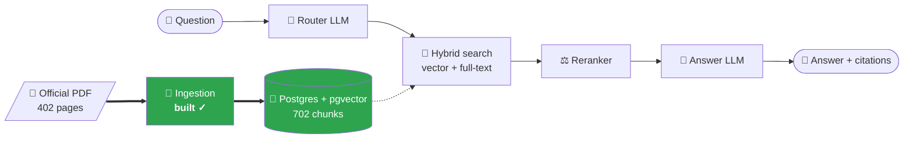
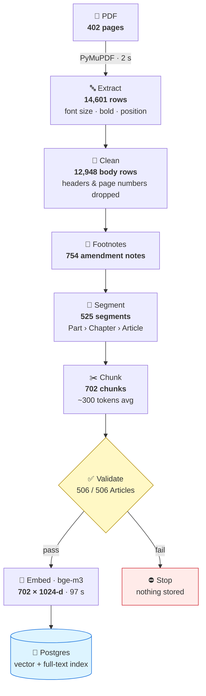
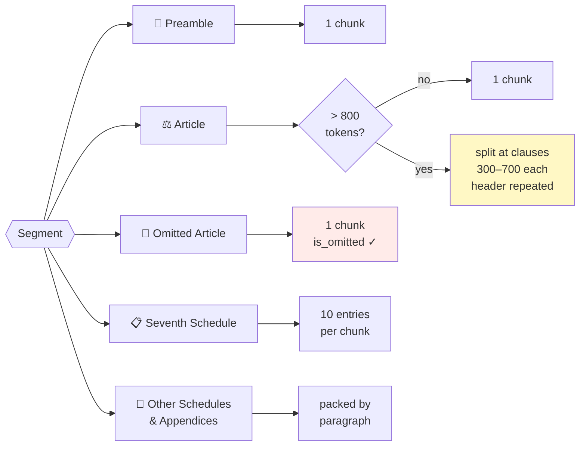
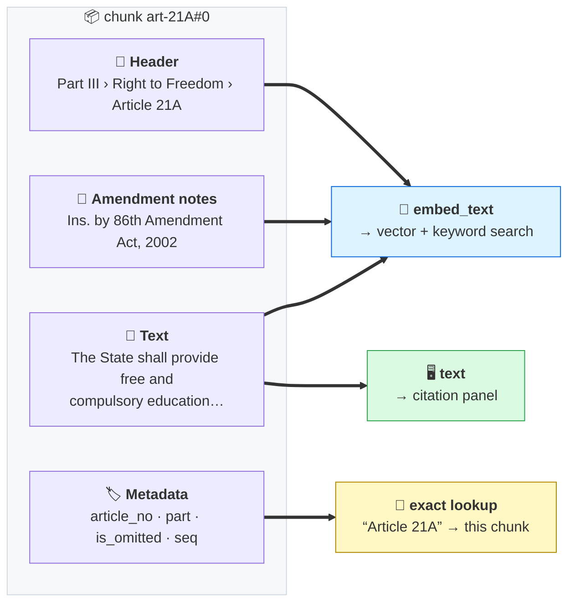
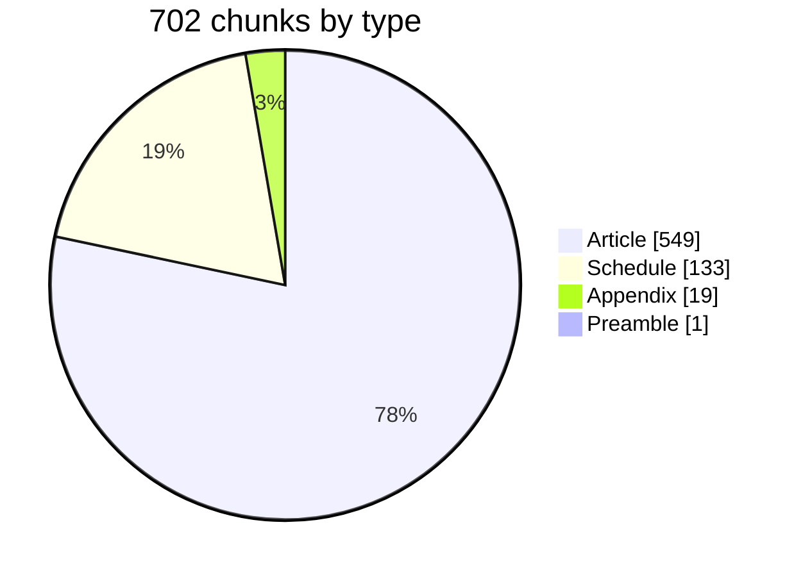
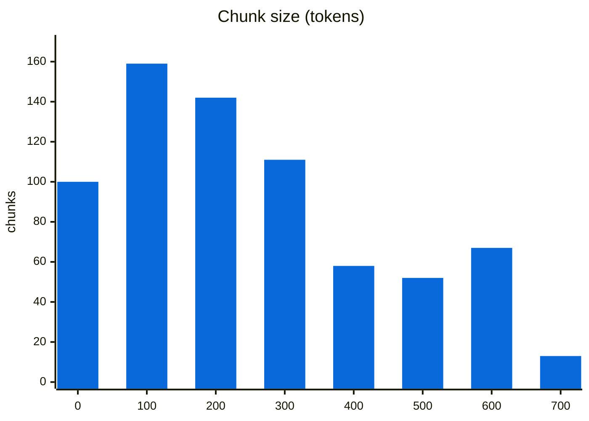
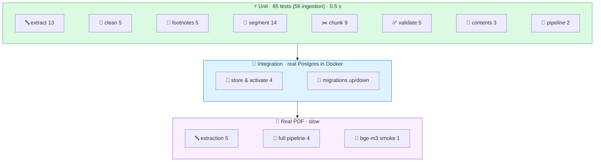

<div align="center">

# 🇮🇳 Samvidhan RAG

**Ask the Constitution of India anything — get answers cited to the exact Article.**


<sub>Informational only — not legal advice.</sub>

</div>

---

## 🗺️ Where we are


<sub>📋 [Full plan](docs/plans/implementation-plan.md) · 🏛️ [Design (HLD)](docs/design/HLD.md) · 🧭 [Decisions (ADRs)](docs/adr/README.md)</sub>

---

## 🧩 The big picture



---

## 📄 How chunking works

> **One chunk per Article** — the Constitution's own structure, not fixed-size windows. <sub>[Why? → ADR-0001](docs/adr/0001-structure-aware-chunking.md)</sub>



<details>
<summary>🔍 <b>Click — what each step does</b></summary>

| Step | Module | Key trick |
|:--|:--|:--|
| 🔤 Extract | [`extract.py`](src/samvidhan/ingestion/extract.py) | Footnote numbers → `{{fn:N}}` tokens; rows rebuilt by position |
| 🧹 Clean | [`clean.py`](src/samvidhan/ingestion/clean.py) | Body starts at **PREAMBLE**, runs to the end |
| 📝 Footnotes | [`footnotes.py`](src/samvidhan/ingestion/footnotes.py) | Numbered by position — survives PDF typos |
| 🧱 Segment | [`segment.py`](src/samvidhan/ingestion/segment.py) | Headings found by **position**, not bold |
| ✂️ Chunk | [`chunk.py`](src/samvidhan/ingestion/chunk.py) | Long Articles split at clauses `(1)`, `(2)`… |
| ✅ Validate | [`validate.py`](src/samvidhan/ingestion/validate.py) | Every Article present, none twice |
| 🧠 Embed | [`embed.py`](src/samvidhan/ingestion/embed.py) | Local model, no API cost |
| 🐘 Store | [`corpus.py`](src/samvidhan/db/repositories/corpus.py) | Same PDF twice → no-op |

📘 Full detail: [ingestion spec](docs/specs/ingestion.md)
</details>

### ✂️ Chunking rules



### 🔬 Anatomy of one chunk



---

## 📊 What landed in the database

<table>
<tr>
<td width="50%">



</td>
<td width="50%">



</td>
</tr>
</table>

| | | | |
|:-:|:-:|:-:|:-:|
| 📚 **506** Articles | ✂️ **28** split | 🚫 **34** omitted | 📋 **12** Schedules |
| 📎 **3** Appendices | 📝 **754** footnotes | 📏 **799** max tokens | ⏱️ **~2 min** full ingest |

---

## 🧪 How it was tested



### ✅ Results

| Check | Result |
|:--|:-:|
| All tests (unit + integration + real PDF) | 🟢 **102 / 102** |
| Articles found vs Contents list | 🟢 **506 / 506** |
| Missing · duplicate · unexpected | 🟢 **0 · 0 · 0** |
| Chunks over the 1,024-token limit | 🟢 **0** |
| Every vector 1024-d, unit length | 🟢 |
| Re-running the same PDF | 🟢 no-op |
| ruff · mypy --strict | 🟢 clean |

<details>
<summary>🐛 <b>Click — tricky things the real PDF taught us (and the tests that pin them)</b></summary>

| 😬 Surprise in the PDF | 🔧 Fix |
|:--|:--|
| Headings are **not bold** | Detect by centered position |
| Omitted Articles have **no bold** | Match `21A.` pattern at heading indent |
| Footnote `1` printed on 6 pt vs 7.9 pt text | Compare to the **document** body size |
| Contents say `243-I`, body says `243I` | Normalise both |
| Footnote numbered `2.` twice (typo) | Number footnotes **by position** |
| `1 S.C.C. 362` looked like footnote 1 | Undotted numbers need a marker on the page |
| Part VII omitted entirely → no Art. 238 | Stub chunk: *"Omitted."* + amendment note |
| Appendix I has its own "FIRST SCHEDULE" | Structure rules off inside Appendices |

Tests: [`tests/unit`](tests/unit) · [`tests/integration`](tests/integration)
</details>

### 🔎 Quick search check (vectors only, before Phase 3)

| 🙋 Question | 🥇 Top hit |
|:--|:--|
| Is education a fundamental right? | **Art. 21A** · Right to education |
| How can the Constitution be amended? | **Art. 368** |
| Which amendment removed the right to property? | **Art. 31** (omitted) |
| What happened to J&K special status in 2019? | **Appendix III** · **Appendix II** · **Art. 370** |

---

## 🚀 Run it

<details>
<summary>▶️ <b>Click — 4 commands</b></summary>

```bash
make setup                      # install + create .env (set POSTGRES_PASSWORD)
make up && make migrate         # Postgres + pgvector on :5433
make models                     # download bge-m3 (~2.3 GB, once)
make ingest ARGS=--activate     # PDF in data/raw/ → 702 chunks in Postgres
```

`make ingest ARGS=--dry-run` → writes `data/processed/chunks.jsonl` + `ingestion_report.json`, no DB.
</details>

---

## 🧰 Stack


## 📚 Docs

| 🏛️ [Design](docs/design/HLD.md) | 🧭 [ADRs](docs/adr/README.md) | 📘 [Specs](docs/specs/) | 📋 [Plan](docs/plans/implementation-plan.md) | 📐 [Standards](docs/standards/engineering-standards.md) | 🤝 [Contributing](CONTRIBUTING.md) |
|:-:|:-:|:-:|:-:|:-:|:-:|
