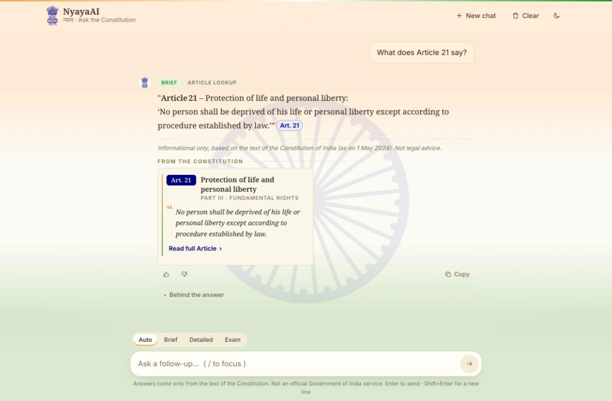
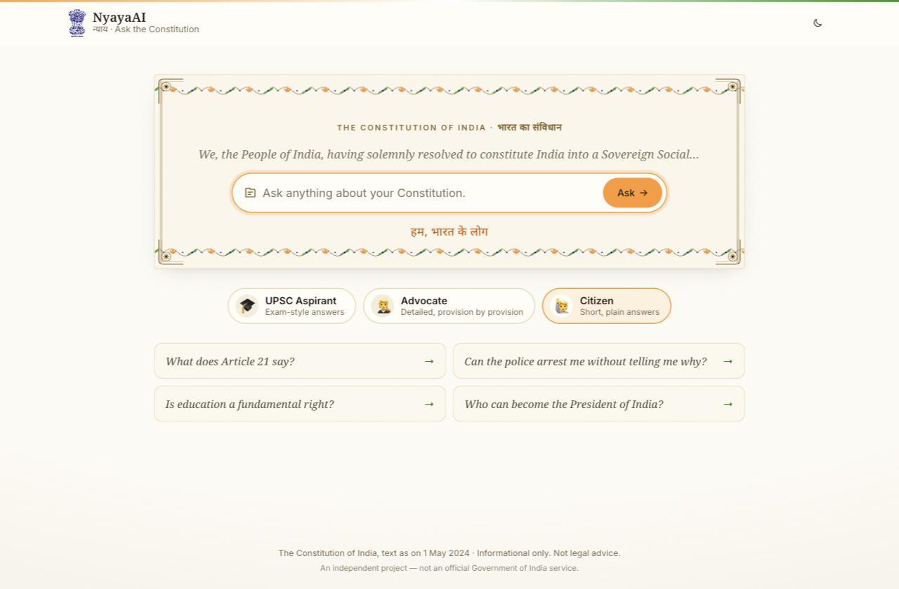
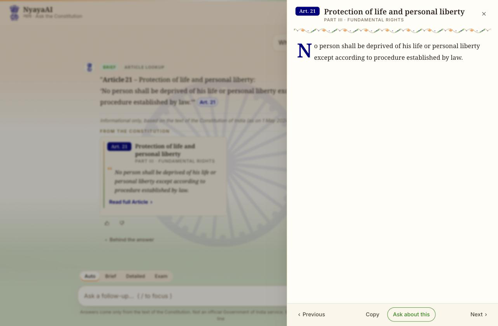
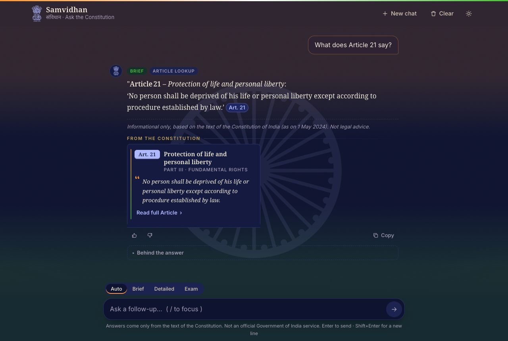

<div align="center">

# 🇮🇳 Samvidhan RAG

**A production-oriented, citation-grounded RAG system for the Constitution of India — designed around retrieval
evaluation, failure handling, and Article-level source attribution.**


-0.93-2ea44f)


<a href="docs/screenshots/ui-chat.png"></a>

<sub>Informational only — not legal advice. Not an official Government of India service.</sub>

</div>

---

## 🏗️ Architecture at a glance

<a href="docs/diagrams/big-picture.svg"></a>

| Layer | What it does | Built with |
|:--|:--|:--|
| 📄 Ingestion | Official PDF → one chunk per Article (long ones split at clauses), 506 / 506 Articles validated | PyMuPDF · bge-m3 (local) |
| 🔎 Retrieval | Vector + full-text search → RRF fusion → cross-encoder rerank; exact "Art. 21-A" lookups pinned | pgvector · Postgres FTS · bge-reranker-v2-m3 |
| 🔀 Router | One small LLM call rewrites the question, extracts Article refs and picks a route | LiteLLM · Groq (Gemini fallback) |
| 🤖 Answer | One large LLM call answers **only** from retrieved chunks, streams tokens, cites `[Art. N]` | LangGraph (orchestration only) |
| 💬 Chat API | Anonymous sessions, structured memory for follow-ups, SSE streaming, rate limits | FastAPI · SQLAlchemy async |
| 🖥️ Web UI | Streaming chat, citation cards, full-Article drawer, answer-style toggle, feedback | Static HTML/CSS/JS served at `/` |
| 📈 Observability | Every LLM attempt → one `llm_calls` row; every stage logged with one `request_id` | structlog · Postgres |

**Three things it is designed around:**

| | How |
|:--|:--|
| 📏 **Retrieval evaluation** | Golden Q&A set with dev/test split; Recall@k, MRR, nDCG, candidate recall, latency; gates in [`evaluation.md`](docs/specs/evaluation.md) block merges; ablations decide what stays |
| 🛡️ **Failure handling** | Retry → fallback model → clean `LLM_UNAVAILABLE`; daily quota guard; "not covered" instead of guessing; weak matches flagged; every HLD limit enforced and tested |
| 📌 **Source attribution** | Citations not in the retrieved text are stripped and logged; each answer shows the quoted Article; the full text is one click away |

<sub>One Postgres, no agent loop, no LangChain retrievers — [HLD](docs/design/HLD.md) · [ADRs](docs/adr/README.md)</sub>

---

## 🗺️ Where we are

<a href="docs/diagrams/roadmap.svg"></a>

| Phase | Status | Left to do |
|:--|:-:|:--|
| 1 · Chunk & store | ✅ | — |
| 2 · Eval harness | 🟡 | Review 67 golden + 20 multi-turn cases, +90 synthetic cases, CI job |
| 3 · Retrieval | 🟡 | Candidate recall@15 0.875 (gate 0.95), rerank p95 ~4–5 s (SLO 0.8 s), then promote baseline |
| 4 · LLM & router | 🟡 | First router eval run (`make eval-router`), long-answer context limits |
| 5 · Chat API | ✅ | — |
| 6 · Web UI | 🟡 | Polish pass: mobile bottom sheet, a11y (P6.8) |
| 7 · v1.0 | ⬜ | RAGAS on the test split, load test, failure drills, security pass |

<sub>📋 [Full plan with every task](docs/plans/implementation-plan.md)</sub>

---

## 🖥️ The web UI

> **The Constitution, talking back** — ivory paper, saffron & green accents, navy citations. Plain HTML/CSS/JS
> served by the API at `/`: no build step, no npm. <sub>[ADR-0013](docs/adr/0013-static-web-ui.md) · [spec](docs/specs/ui.md)</sub>

<table>
<tr>
<td width="33%"><a href="docs/screenshots/ui-landing.png"></a><br/><sub><b>Landing</b> — Preamble → search box, personas, Article of the Day</sub></td>
<td width="33%"><a href="docs/screenshots/ui-drawer.png"></a><br/><sub><b>Read full Article</b> — drawer with prev / next</sub></td>
<td width="33%"><a href="docs/screenshots/ui-night.png"></a><br/><sub><b>Night reading</b> — follows the OS or the toggle</sub></td>
</tr>
</table>

- **Ask** — streamed answers with `Art. 21` pills and quoted citation cards; Auto / Brief / Detailed / Exam toggle.
- **Explore** — personas (UPSC Aspirant · Advocate · Citizen) with starter questions; Article of the Day.
- **Keep** — 👍 / 👎 with a comment; history restored on reload; New chat / Clear.
- **Debug** — "Behind the answer" shows the route and scored chunks when `DEBUG_UI=true` (turn off when public).

---

## 🤖 How a question is answered

> **One small LLM call routes, one large LLM call answers** — a fixed LangGraph pipeline, not an agent.
> <sub>[ADR-0003](docs/adr/0003-deterministic-router-not-agent.md) · [ADR-0011](docs/adr/0011-langgraph-orchestration.md) · [spec](docs/specs/llm-router-generation.md)</sub>

<a href="docs/diagrams/langgraph.svg"></a>

<sub>Drawn from the compiled graph itself (`make graph`), so it can't drift from the code.</sub>

| Route | Example | What happens | LLM calls |
|:--|:--|:--|:-:|
| `article_lookup` | "explain art. 21-A" | Article fetched by number, plus search for context | 2 |
| `simple` | "Who appoints the Chief Election Commissioner?" | Hybrid search + rerank | 2 |
| `conceptual` | "How does the Constitution protect minorities?" | HyDE passage for the vector search | 3 |
| `multi_part` | "Compare Article 32 and 226" | One search per sub-question, merged | 2 |
| `ambiguous` · `out_of_scope` · `chitchat` | "What are my rights?" · "BNS theft?" · "hi" | Canned reply, no search | 1 |

<details>
<summary>🛡️ <b>Guards — what keeps answers honest</b></summary>

| Guard | How |
|:--|:--|
| Only the retrieved text | The answer prompt gets numbered excerpts and must cite them as `[Art. 21]` |
| Hallucinated citations | Any `[Art. N]` not among the retrieved chunks is removed and logged (`invalid_citation`) |
| Nothing found | No answer LLM call — a "not covered" reply instead |
| Weak match | The prompt is told retrieval is weak and must say the text may not cover it |
| Prompt injection | Excerpts and the user's message are data; the router sends "ignore your rules" to `out_of_scope` |
| Provider down / bad key | 1 retry → Gemini fallback → `LLM_UNAVAILABLE` |
| Free-tier quota | Usage counted from `llm_calls`; near the cap → fallback model → "busy" |
| Overload / abuse | Per-session and per-IP rate limits, message size caps, max concurrent streams → 429 / 422 / 503 |

</details>

<details>
<summary>📡 <b>API — endpoints and a curl session</b></summary>

| Endpoint | What it does |
|:--|:--|
| `POST /v1/sessions` | New anonymous chat → `{session_id}` (UUIDv7) |
| `GET /v1/sessions/{id}/messages` | History, oldest first, paged |
| `DELETE /v1/sessions/{id}` | Clear the chat |
| `POST /v1/chat` | `{session_id, message, answer_style?}` → SSE `meta → token… → citations → done`, or JSON |
| `POST /v1/messages/{id}/feedback` | 👍 / 👎 `{rating, comment?}` |
| `GET /v1/articles/{no}` | Full text of `21A`, `21-A`, `Sch. 7`, `preamble`… |
| `GET /v1/meta` | Edition date, pipeline versions, model ids |

```bash
SID=$(curl -s -XPOST localhost:8000/v1/sessions | jq -r .session_id)
curl -N localhost:8000/v1/chat -H 'content-type: application/json' \
  -d "{\"session_id\":\"$SID\",\"message\":\"What does Article 21 say?\"}"
curl -N localhost:8000/v1/chat -H 'content-type: application/json' \
  -d "{\"session_id\":\"$SID\",\"message\":\"What are its exceptions?\"}"   # "its" → Art. 21, from memory
```

From the terminal without the API: `make ask Q="What does Article 21 say?"` (add `ARGS=--fake-llm` to run
without API keys) or `make chat`. Spec: [`api-sessions-memory.md`](docs/specs/api-sessions-memory.md).

</details>

> ⚠️ **Models:** Groq retired the Llama 3.1 8B / 3.3 70B models first planned on. The router runs on
> `qwen/qwen3.8-27b`, answers on `openai/gpt-oss-120b`, Gemini 3.5 as fallback — all set in `.env`, never in code.
> See [HLD §6](docs/design/HLD.md#6-models).

---

## 📄 How chunking works

> **One chunk per Article** — the Constitution's own structure, not fixed-size windows. <sub>[ADR-0001](docs/adr/0001-structure-aware-chunking.md) · [spec](docs/specs/ingestion.md)</sub>

<a href="docs/diagrams/chunking-pipeline.svg"></a>

<a href="docs/diagrams/chunking-rules.svg"></a>

<details>
<summary>🔬 <b>Anatomy of one chunk</b></summary>

<a href="docs/diagrams/chunk-anatomy.svg"></a>

</details>

<details>
<summary>🐛 <b>Tricky things the real PDF taught us</b> (each pinned by a test)</summary>

| 😬 Surprise in the PDF | 🔧 Fix |
|:--|:--|
| Headings are **not bold** | Detect by centered position |
| Footnote `1` printed on 6 pt vs 7.9 pt text | Compare to the **document** body size |
| Contents say `243-I`, body says `243I` | Normalise both |
| Footnote numbered `2.` twice (typo) | Number footnotes **by position** |
| Part VII omitted entirely → no Art. 238 | Stub chunk: *"Omitted."* + amendment note |
| Appendix I has its own "FIRST SCHEDULE" | Structure rules off inside Appendices |

</details>

<table>
<tr>
<td width="50%"><a href="docs/diagrams/chunks-by-type.svg"></a></td>
<td width="50%"><a href="docs/diagrams/chunk-sizes.svg"></a></td>
</tr>
</table>

| | | | |
|:-:|:-:|:-:|:-:|
| 📚 **506** Articles | ✂️ **28** split | 🚫 **34** omitted | 📋 **12** Schedules |
| 📎 **3** Appendices | 📝 **754** footnotes | 📏 **799** max tokens | ⏱️ **~2 min** full ingest |

---

## 📏 Evaluation

`make eval-retrieval` · dev split, golden v0.1, 36 gated cases · dense + full-text → RRF → rerank ·
report: [`2026-10-01T06-29-04_retrieval_dev.md`](eval/reports/2026-10-01T06-29-04_retrieval_dev.md)

| Metric | Value | Gate | Status |
|:--|:--:|:--:|:--:|
| Recall@5 | **0.931** | ≥ 0.90 | ✅ |
| MRR@10 | **0.931** | ≥ 0.75 | ✅ |
| Hit@1 (Article lookups) | **1.000** | = 1.00 | ✅ via pinning |
| Candidate recall@15 (before rerank) | **0.875** | ≥ 0.95 | ❌ |
| nDCG@5 | 0.877 | — | info |
| Retrieval latency p50 / p95 | 76 / 95 ms | p95 ≤ 300 ms | ✅ |
| Rerank latency p50 / p95 | 2,817 / 4,846 ms | p95 ≤ 800 ms | ❌ |

Baseline not promoted yet: candidate recall and rerank latency are open. Router eval (`make eval-router`; type
accuracy ≥ 0.90, refs F1 ≥ 0.95, JSON validity ≥ 0.99) — first dev run pending.

<details>
<summary>🧪 <b>Ablation</b> — which part earns its keep</summary>

| Variant | Recall@5 | MRR@10 | nDCG@5 | Lookup Hit@1 unpinned | Cand. recall@15 |
|:--|:--:|:--:|:--:|:--:|:--:|
| Dense only | 0.889 | 0.846 | 0.802 | 0.000 | 0.972 |
| Full-text only (OR) | 0.625 | 0.563 | 0.516 | 0.200 | 0.486 |
| Hybrid (RRF) | 0.778 | 0.707 | 0.664 | 0.300 | 0.875 |
| **Hybrid + rerank (current)** | **0.931** | **0.931** | **0.877** | 0.500 | 0.875 |
| Dense + rerank (no full-text) | 0.958 | 0.962 | 0.911 | 0.700 | 0.972 |
| Hybrid + rerank, 25 candidates | 0.931 | 0.933 | 0.883 | 0.600 | 0.944 |

The reranker adds the most (Recall@5 0.778 → 0.931). On this set dense + rerank beats the current setup; whether
to keep the full-text leg is open (ADR-0002). Full: [`ablation_v1.md`](eval/reports/ablation_v1.md)
</details>

<details>
<summary>🗂️ <b>By category, pinning and low-confidence threshold</b></summary>

| Category | n | Recall@5 | MRR@10 | Hit@1 | Cand. recall@15 |
|:--|:--:|:--:|:--:|:--:|:--:|
| article_lookup | 10 | 1.000 | 1.000 | 1.000 | 0.800 |
| simple (plain language) | 12 | 0.917 | 0.917 | 0.917 | 0.917 |
| multi_part | 3 | 1.000 | 1.000 | 1.000 | 1.000 |
| conceptual | 3 | 1.000 | 1.000 | 1.000 | 1.000 |
| schedule | 4 | 0.750 | 0.625 | 0.500 | 0.750 |
| omitted_amended | 3 | 0.833 | 1.000 | 1.000 | 0.833 |
| adversarial | 1 | 1.000 | 1.000 | 1.000 | 1.000 |
| long_query *(not gated)* | 5 | 0.540 | 0.800 | 0.600 | 0.613 |

- **Pinning:** 12 of 36 questions name an Article; the eval pins it, standing in for the router. Search alone
  scores Recall@5 0.875 and lookup Hit@1 0.500 — so exact lookups depend on the router's refs (ADR-0004).
- **Misses:** "supreme commander of the armed forces" (Art. 53 says "supreme command of the Defence Forces"),
  Art. 300A crowded out by 31A–31D, "is defence only for Parliament?" (gets Art. 246, not the Seventh Schedule).
- **Low confidence:** best split of top rerank score between correct hits and misses is 0.054 (88% accuracy), so
  `LOW_CONFIDENCE_THRESHOLD=0.05` — provisional until golden v1.0.
</details>

---

## 🧪 How it was tested

<a href="docs/diagrams/tests.svg"></a>

| Check | Result |
|:--|:-:|
| Test suite — unit, integration (real Postgres), real PDF & models | 🟢 **353 / 354** — the 1 live Groq router test (`make test-llm`) returned a provider error |
| Articles found vs Contents list · missing · duplicate | 🟢 **506 / 506** · 0 · 0 |
| Chunks over the 1,024-token limit · re-ingesting the same PDF | 🟢 0 · no-op |
| Graph end to end, all 7 route types (FakeLLM + real search) | 🟢 |
| Bad primary key → fallback model; every attempt → one `llm_calls` row | 🟢 |
| Every HLD §13.2 limit (length, rate, concurrency, timeout, truncation…) | 🟢 14 tests |
| One request → every stage logged with the same `request_id` | 🟢 |
| ruff · mypy --strict | 🟢 clean |

---

## 🚀 Run it

```bash
make setup                      # install + create .env (set POSTGRES_PASSWORD, GROQ_API_KEY, GEMINI_API_KEY)
make up && make migrate         # Postgres + pgvector on :5433
make models RERANK=1            # download bge-m3 + reranker (~4.5 GB, once)
make ingest ARGS=--activate     # PDF in data/raw/ → 702 chunks in Postgres
make run                        # API + web UI → http://localhost:8000/
```

Or everything in Docker: `docker compose --profile app up`. `make ingest ARGS=--dry-run` writes
`data/processed/chunks.jsonl` without touching the DB.

---

## 🧰 Stack & docs


| 🏛️ [Design](docs/design/HLD.md) | 🧭 [ADRs](docs/adr/README.md) | 📘 [Specs](docs/specs/) | 📋 [Plan](docs/plans/implementation-plan.md) | 📐 [Standards](docs/standards/engineering-standards.md) | 🤝 [Contributing](CONTRIBUTING.md) |
|:-:|:-:|:-:|:-:|:-:|:-:|
